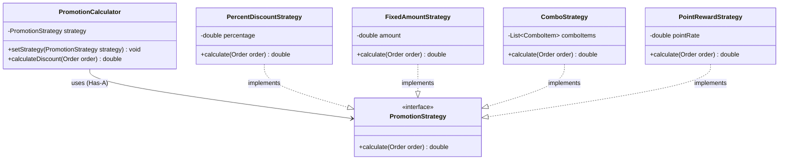

# Báo Cáo Thiết Kế Kiến Trúc Hệ Thống PharmaChain

Tài liệu này trình bày giải pháp thiết kế kiến trúc cho hệ thống **PharmaChain** (Quản lý chuỗi nhà thuốc) nhằm giải quyết hai yêu cầu cốt lõi về **tính khả đổi (Modifiability)** cho chức năng Khuyến mãi/Tích điểm và **tính an toàn/độ tin cậy (Safety/Reliability)** cho chức năng Xử lý toa thuốc kê đơn.

---

## CÂU 1. ÁP DỤNG STRATEGY PATTERN CHO CHỨC NĂNG KHUYẾN MÃI VÀ TÍCH ĐIỂM

### 1. Lý Do Chọn Mẫu Thiết Kế (Strategy Pattern)
Trong ngành bán lẻ dược phẩm, các chương trình khuyến mãi và chính sách tích lũy điểm thưởng thường xuyên thay đổi để phù hợp với các chiến dịch marketing, dịp lễ, hoặc chính sách cạnh tranh.
*   **Vấn đề của cách tiếp cận thông thường (Anti-pattern):** Nếu chúng ta viết tất cả các quy tắc tính toán (giảm giá %, giảm tiền mặt, combo, nhân đôi điểm) bằng các câu lệnh rẽ nhánh `if-else` hoặc `switch-case` lồng nhau trong một lớp duy nhất (ví dụ: `CheckoutService`), mã nguồn sẽ nhanh chóng phình to, cực kỳ khó đọc, khó viết unit test và dễ gây lỗi hệ thống mỗi khi thêm hoặc thay đổi một chính sách.
*   **Giải pháp từ Strategy Pattern:** Mẫu thiết kế này tách biệt phần thuật toán tính khuyến mãi ra khỏi đối tượng sử dụng thuật toán. Mỗi quy tắc khuyến mãi được đóng gói thành một lớp chiến lược riêng biệt (Concrete Strategy) hiện thực chung một giao diện (Interface). Điều này tuân thủ nghiêm ngặt **Nguyên lý Open/Closed (OCP)**: *Mở rộng khi thêm chính sách mới, đóng đối với việc sửa đổi mã nguồn cốt lõi.*

### 2. Sơ Đồ Lớp Kiến Trúc (Mermaid Class Diagram)

Dưới đây là sơ đồ kiến trúc Strategy Pattern áp dụng cho PharmaChain:



### 3. Mã Nguồn Minh Họa (TypeScript Example)

Dưới đây là mã nguồn hiện thực hóa kiến trúc trên bằng TypeScript, đảm bảo tính sạch sẽ, dễ bảo trì:

```typescript
// 1. Định nghĩa interface cho Chiến lược Khuyến mãi
export interface OrderItem {
  medicineId: string;
  price: number;
  quantity: number;
}

export interface Order {
  id: string;
  items: OrderItem[];
  subtotal: number;
  customerTier: 'normal' | 'silver' | 'gold' | 'platinum';
}

export interface PromotionStrategy {
  calculate(order: Order): number;
}

// 2. Hiện thực các Chiến lược Cụ thể (Concrete Strategies)

// Chiến lược 1: Giảm giá theo phần trăm
export class PercentDiscountStrategy implements PromotionStrategy {
  constructor(private percentage: number) {}

  calculate(order: Order): number {
    return order.subtotal * (this.percentage / 100);
  }
}

// Chiến lược 2: Giảm giá theo số tiền cố định
export class FixedAmountStrategy implements PromotionStrategy {
  constructor(private amount: number) {}

  calculate(order: Order): number {
    return Math.min(this.amount, order.subtotal); // Không giảm vượt quá giá trị đơn hàng
  }
}

// Chiến lược 3: Giảm giá theo Combo (Mua A tặng B hoặc giảm giá gói)
export class ComboStrategy implements PromotionStrategy {
  constructor(private requiredMedicineId: string, private discountValue: number) {}

  calculate(order: Order): number {
    const hasRequiredItem = order.items.some(item => item.medicineId === this.requiredMedicineId);
    return hasRequiredItem ? this.discountValue : 0;
  }
}

// Chiến lược 4: Nhân đôi/tích lũy điểm thưởng dựa trên hạng thành viên
export class PointRewardStrategy implements PromotionStrategy {
  calculate(order: Order): number {
    let multiplier = 1;
    if (order.customerTier === 'gold') multiplier = 1.5;
    if (order.customerTier === 'platinum') multiplier = 2.0;
    
    // 1 điểm thưởng cho mỗi 10$ chi tiêu, nhân với hệ số khách hàng thân thiết
    return Math.floor(order.subtotal / 10) * multiplier;
  }
}

// 3. Lớp Context điều hướng (PromotionCalculator)
export class PromotionCalculator {
  private strategy!: PromotionStrategy;

  public setStrategy(strategy: PromotionStrategy): void {
    this.strategy = strategy;
  }

  public calculate(order: Order): number {
    if (!this.strategy) {
      return 0; // Không áp dụng khuyến mãi
    }
    return this.strategy.calculate(order);
  }
}
```

### 4. Các Lợi Ích Mang Lại
*   **Tính linh hoạt cao:** Người quản lý hệ thống có thể cấu hình áp dụng chồng chéo hoặc thay đổi chiến lược tính giá tại thời điểm runtime (bằng phương thức `setStrategy`).
*   **Độc lập thử nghiệm (Easy Unit Testing):** Có thể viết unit test riêng lẻ cho `PercentDiscountStrategy`, `FixedAmountStrategy` mà không cần giả lập toàn bộ quy trình checkout phức tạp.
*   **Tránh mã nguồn chết:** Khi một chương trình khuyến mãi kết thúc, ta chỉ cần xóa tệp chiến lược đó đi hoặc không gọi tới nó nữa mà không sợ ảnh hưởng đến các logic bán hàng khác.

---

## CÂU 2. SỬ DỤNG FAULT TREE ĐỂ PHÂN TÍCH THUỘC TÍNH CHẤT LƯỢNG CHO TÍNH NĂNG "XỬ LÝ TOA THUỐC"

Để bảo vệ thuộc tính chất lượng **An toàn (Safety)** và **Độ tin cậy (Reliability)**, nhóm đã áp dụng phương pháp **Fault Tree Analysis (FTA - Phân tích cây lỗi)** đối với tính năng **Xử lý toa thuốc kê đơn (Rx)**.

### 1. Sự Kiện Đỉnh (Top Event)
> **[SỰ KIỆN NGUY HIỂM]**: **BÁN SAI THUỐC THEO TOA**
> Đây là lỗi vận hành cấp độ nghiêm trọng nhất trong chuỗi nhà thuốc, trực tiếp đe dọa sức khỏe/tính mạng của người bệnh và gây ảnh hưởng pháp lý nặng nề đến uy tín thương hiệu.

### 2. Sơ Đồ Cây Lỗi (Mermaid Fault Tree Diagram)

Dưới đây là cây phân tích lỗi trực quan, thể hiện mối quan hệ logic giữa sự kiện đỉnh và các sự kiện trung gian thông qua các cổng logic OR:

```mermaid
graph TD
    classDef topEvent fill:#ffcccc,stroke:#ff3333,stroke-width:3px,font-weight:bold,color:#000;
    classDef gate fill:#e6f2ff,stroke:#0066cc,stroke-width:2px,shape:stadium,color:#000;
    classDef basic fill:#f5f5f5,stroke:#666,stroke-width:1px,color:#000;

    Top[SỰ KIỆN ĐỈNH: Bán sai thuốc theo toa]:::topEvent
    OR1{CỔNG OR: Nguyên nhân chính}:::gate
    
    Top --> OR1
    
    OR1 --> IN[1. Lỗi dữ liệu đầu vào]:::gate
    OR1 --> PROC[2. Lỗi xử lý nghiệp vụ]:::gate
    OR1 --> STOCK[3. Lỗi dữ liệu tồn kho & sản phẩm]:::gate
    OR1 --> UI[4. Lỗi giao diện & thao tác]:::gate
    
    %% 1. Input Errors
    OR_IN{CỔNG OR}:::gate
    IN --> OR_IN
    OR_IN --> IN1[Toa thuốc bị mờ / khó đọc]:::basic
    OR_IN --> IN2[Nhân viên nhập sai tên thuốc]:::basic
    OR_IN --> IN3[Nhập sai hàm lượng hoặc đơn vị]:::basic
    OR_IN --> IN4[Nhập sai số lượng kê đơn]:::basic
    
    %% 2. Process Errors
    OR_PROC{CỔNG OR}:::gate
    PROC --> OR_PROC
    OR_PROC --> PROC1[Không bắt buộc Dược sĩ xác nhận]:::basic
    OR_PROC --> PROC2[Thiếu các luật kiểm tra tương tác thuốc]:::basic
    OR_PROC --> PROC3[Bỏ qua đối chiếu danh mục thuốc nội bộ]:::basic
    OR_PROC --> PROC4[Không có bước xác nhận trước khi in hóa đơn]:::basic
    
    %% 3. Stock Errors
    OR_STOCK{CỔNG OR}:::gate
    STOCK --> OR_STOCK
    OR_STOCK --> STOCK1[Mapping sai giữa thuốc trong toa và hệ thống]:::basic
    OR_STOCK --> STOCK2[Chọn nhầm lô thuốc / xuất sai lô]:::basic
    OR_STOCK --> STOCK3[Dữ liệu tồn kho chưa đồng bộ giữa các chi nhánh]:::basic
    OR_STOCK --> STOCK4[Cùng tên thương mại nhưng khác hàm lượng/dạng bào chế]:::basic
    
    %% 4. UI/UX Errors
    OR_UI{CỔNG OR}:::gate
    UI --> OR_UI
    OR_UI --> UI1[Giao diện hiển thị danh sách tương tự gây nhầm lẫn]:::basic
    OR_UI --> UI2[Cảnh báo không nổi bật / dễ bị bỏ qua]:::basic
    OR_UI --> UI3[Thu ngân hoặc dược sĩ bấm nhầm dòng thuốc]:::basic
    OR_UI --> UI4[Thiếu kiểm duyệt chéo giữa các nhân viên]:::basic
```



### 3. Đề Xuất Biện Pháp Giảm Thiểu Mức Kiến Trúc & Thiết Kế
Dựa trên các nhánh lỗi từ Fault Tree, nhóm thiết kế đề xuất các biện pháp giảm thiểu tự động hóa trên phần mềm:

| Mã Nguyên Nhân | Tên Sự Kiện Lỗi | Giải Pháp Giảm Thiểu Mức Kỹ Thuật |
| :--- | :--- | :--- |
| **IN1, IN2** | Nhập sai tên thuốc, toa mờ | Tích hợp công nghệ OCR tự động nhận diện chữ viết tay bác sĩ, so khớp mờ (fuzzy matching) với danh mục thuốc quốc gia. |
| **PROC1** | Không bắt buộc Dược sĩ duyệt | Hiện thực quy trình phân quyền: Chỉ người có quyền `prescription.verify` (Dược sĩ/Branch Manager) mới được bấm phê duyệt xuất toa. POS bán hàng thông thường bị chặn. |
| **PROC2** | Thiếu luật kiểm tra tương tác | Tích hợp Database kiểm tra tương tác thuốc. Hệ thống tự động cảnh báo đỏ nếu toa thuốc có 2 chất đối kháng nhau. |
| **STOCK2** | Chọn nhầm lô thuốc | Quét mã vạch (Barcode/QR Code) của vỉ/hộp thuốc thực tế lúc xuất hàng để hệ thống tự nhận diện đúng Lô/Hạn sử dụng, không cho chọn thủ công tự do. |
| **UI1, UI2** | Giao diện nhầm lẫn, thiếu cảnh báo | Áp dụng quy tắc thiết kế LASA (Look-alike, Sound-alike) - hiển thị chữ hoa chữ thường xen kẽ để làm nổi bật sự khác biệt của các thuốc gần giống nhau (Ví dụ: Tra**MA**dol và Tra**ZO**done) và sử dụng Modal cảnh báo bắt buộc bấm nút xác nhận. |
| **Hệ thống** | Lỗi bất đối xứng dữ liệu | Lưu trữ Audit log chi tiết (ai quét toa, ai chọn thuốc, ai duyệt, vào thời gian nào) để phục vụ đối soát và nâng cao trách nhiệm nhân viên. |

---

## KẾT LUẬN CHUNG

*   **Strategy Pattern** là chìa khóa giúp PharmaChain thích ứng nhanh chóng với các thay đổi kinh doanh liên tục về Khuyến mãi và Tích điểm, đáp ứng hoàn hảo thuộc tính **Khả đổi (Modifiability)**.
*   **Fault Tree Analysis** đóng vai trò lá chắn định hướng thiết kế phần mềm, giúp tính năng **Xử lý toa thuốc** ngăn chặn các lỗi nghiêm trọng ngay từ mức giao diện và nghiệp vụ, nâng tầm thuộc tính **An toàn (Safety)** và **Độ tin cậy (Reliability)** cho sản phẩm.
